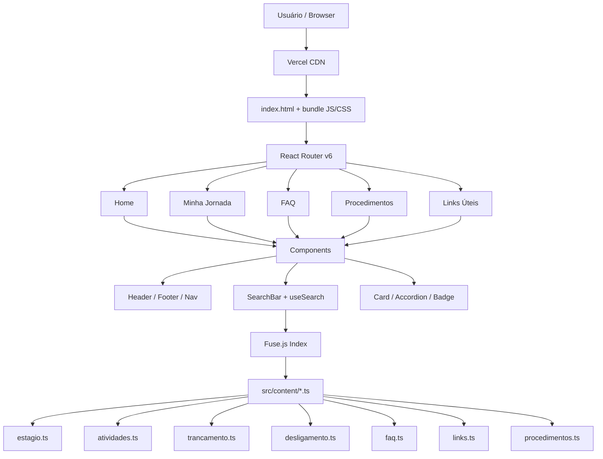
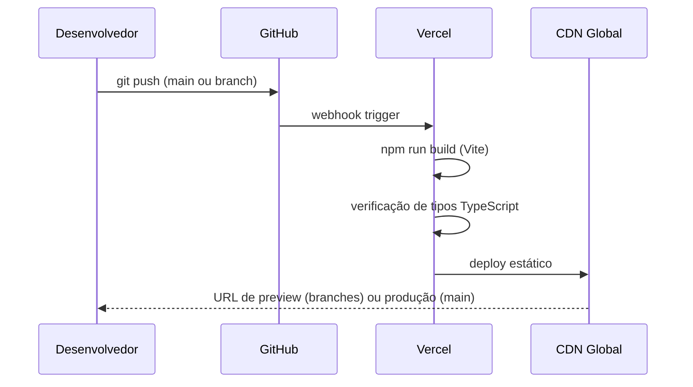

# EPR Info Hub — Stack Tecnológica

## Resumo Executivo

O EPR Info Hub é uma **Single Page Application (SPA) estática**, sem backend próprio, sem banco de dados e com custo de hospedagem zero. A stack foi escolhida para maximizar velocidade de desenvolvimento, facilidade de manutenção por não-programadores (via edição de arquivos `.ts` no GitHub) e aderência ao design system da UnB.

---

## Stack Principal

| Camada | Tecnologia | Versão |
|---|---|---|
| Linguagem | TypeScript | 5.x |
| Framework UI | React | 18.x |
| Build tool | Vite | 6.x |
| Styling | Tailwind CSS | 3.x |
| Roteamento | React Router | 6.x |
| Busca | Fuse.js | 7.x |
| Hospedagem | Vercel | — |
| CI/CD | GitHub Actions | — |
| Controle de versão | Git + GitHub | — |

---

## Justificativas por Camada

### TypeScript
**Por que:** tipagem estática elimina uma classe inteira de bugs em tempo de compilação. Num projeto mantido por múltiplas pessoas ao longo do tempo, a autocomplete e os erros de tipo no editor funcionam como documentação viva.
**Alternativa considerada:** JavaScript puro — descartado pela falta de segurança de tipos em projetos colaborativos.

### React + Vite
**Por que:** React é o ecossistema mais maduro para SPAs em 2026, com vasta documentação em português e curva de aprendizado conhecida pela equipe. O Vite substitui o Create React App (deprecado), oferece HMR instantâneo e build otimizado com tree-shaking nativo.
**Alternativa considerada:** Next.js — descartado porque não há necessidade de SSR/SSG para este projeto. Uma SPA pura é mais simples de hospedar estaticamente.

### Tailwind CSS
**Por que:** utilitário mobile-first nativo. Permite aplicar o design system da UnB como tokens no `tailwind.config.ts`, sem criar camadas adicionais de abstração CSS. O resultado é HTML semântico com classes descritivas, fácil de auditar e manter.
**Alternativa considerada:** CSS Modules — mais verboso para este escopo; Styled Components — overhead de runtime desnecessário para um app estático.

### React Router v6
**Por que:** padrão de facto para roteamento client-side em React. A v6 traz `createBrowserRouter` com layouts aninhados, lazy loading de rotas e tratamento de erros integrado.
**Alternativa considerada:** TanStack Router — mais poderoso, mas com curva de aprendizado maior para o escopo do projeto.

### Fuse.js
**Por que:** busca fuzzy client-side de alta performance, sem servidor, sem API key, sem custo. Funciona com os dados já carregados na memória da SPA. Índice construído uma vez no boot, buscas em <10ms.
**Alternativa considerada:** Algolia (plano gratuito) — dependência de serviço externo que pode ser descontinuado ou mudar de política; não justificado para um corpus pequeno e estático.

### Vercel
**Por que:** deploy automatizado a cada push no GitHub, CDN global, HTTPS gratuito, preview por branch. O plano Hobby cobre 100% das necessidades do projeto (sem backend, sem banco de dados).
**Alternativa considerada:** GitHub Pages — sem preview por branch e sem redirecionamentos para SPA out-of-the-box; Netlify — equivalente ao Vercel, mas a equipe já tem conta Vercel configurada.

---

## Design System UnB — Tokens no Tailwind

As cores institucionais da UnB (extraídas do *Manual de Identidade Visual*, 1ª edição) são configuradas como tokens no `tailwind.config.ts`:

```ts
// tailwind.config.ts
import type { Config } from 'tailwindcss'

const config: Config = {
  content: ['./index.html', './src/**/*.{ts,tsx}'],
  theme: {
    extend: {
      colors: {
        'unb-azul':        '#003366', // Pantone 654, Azul institucional
        'unb-azul-light':  '#1a4d80', // variante hover / elementos secundários
        'unb-azul-pale':   '#e8eef5', // fundos suaves, cards
        'unb-verde':       '#006633', // Pantone 348, Verde institucional
        'unb-verde-light': '#1a7a47', // variante hover
        'unb-verde-pale':  '#e6f2ec', // badges de sucesso, confirmações
        'unb-cinza':       '#f5f5f5', // fundo de página
        'unb-texto':       '#1a1a2e', // cor primária de texto
        'unb-alerta':      '#c0392b', // badges de prazo crítico
        'unb-aviso':       '#e67e22', // badges de atenção
      },
      fontFamily: {
        // Inter: substituto moderno e gratuito das fontes UnB Pro/Office
        // UnB Pro é derivada de Liberation Sans (grotesca geométrica)
        // Inter tem características similares: humanista, alta legibilidade em tela
        sans: ['Inter', 'system-ui', 'sans-serif'],
      },
    },
  },
  plugins: [],
}

export default config
```

### Paleta de cores completa

| Token | Hex | Uso |
|---|---|---|
| `unb-azul` | `#003366` | Header, botões primários, links ativos |
| `unb-azul-light` | `#1a4d80` | Hover de botões, bordas de destaque |
| `unb-azul-pale` | `#e8eef5` | Fundo de cards, seções alternadas |
| `unb-verde` | `#006633` | Acentos, ícones de confirmação, badge "ok" |
| `unb-verde-light` | `#1a7a47` | Hover de elementos verdes |
| `unb-verde-pale` | `#e6f2ec` | Background de alertas positivos |
| `unb-alerta` | `#c0392b` | Badges de prazo crítico |
| `unb-aviso` | `#e67e22` | Badges de atenção moderada |
| `unb-cinza` | `#f5f5f5` | Background geral da página |
| `unb-texto` | `#1a1a2e` | Texto principal |

### Tipografia

```html
<!-- index.html — Google Fonts import -->
<link rel="preconnect" href="https://fonts.googleapis.com">
<link href="https://fonts.googleapis.com/css2?family=Inter:wght@400;500;600;700;800&display=swap" rel="stylesheet">
```

**Escala tipográfica Tailwind:**
- `text-4xl font-bold` — títulos de seção H1
- `text-2xl font-semibold` — títulos de card H2
- `text-base font-normal` — corpo de texto
- `text-sm` — rótulos, badges, metadados

---

## Arquitetura da Aplicação



---

## Estrutura de Pastas

```
EPR Info Hub/
├── docs/
│   ├── MISSION.md
│   ├── TECH_STACK.md
│   └── ROADMAP.md
├── public/
│   └── favicon.ico
├── src/
│   ├── content/               # dados estáticos tipados
│   │   ├── types.ts           # interfaces TypeScript compartilhadas
│   │   ├── estagio.ts         # estágio obrigatório
│   │   ├── atividades.ts      # atividades complementares
│   │   ├── trancamento.ts     # modalidades de trancamento
│   │   ├── desligamento.ts    # causas e reintegração
│   │   ├── prorrogacao.ts     # prorrogação de prazo
│   │   ├── ira.ts             # IRA e rendimento acadêmico
│   │   ├── faq.ts             # perguntas frequentes
│   │   ├── procedimentos.ts   # guias passo a passo
│   │   └── links.ts           # canais oficiais e links
│   ├── components/
│   │   ├── layout/
│   │   │   ├── Header.tsx
│   │   │   ├── Footer.tsx
│   │   │   └── Layout.tsx
│   │   ├── ui/
│   │   │   ├── Card.tsx
│   │   │   ├── Accordion.tsx
│   │   │   ├── Badge.tsx
│   │   │   ├── SearchBar.tsx
│   │   │   └── StepGuide.tsx
│   │   └── sections/
│   │       ├── HeroSection.tsx
│   │       ├── QuickAccess.tsx
│   │       └── AlertBanner.tsx
│   ├── hooks/
│   │   └── useSearch.ts       # wrapper Fuse.js
│   ├── pages/
│   │   ├── Home.tsx
│   │   ├── Jornada.tsx
│   │   ├── FAQ.tsx
│   │   ├── Procedimentos.tsx
│   │   └── Links.tsx
│   ├── App.tsx                # router setup
│   ├── main.tsx
│   └── index.css              # Tailwind directives + globals
├── index.html
├── package.json
├── tailwind.config.ts
├── tsconfig.json
└── vite.config.ts
```

---

## Fluxo de CI/CD



**Regras de branch:**
- `main` → deploy automático em produção
- qualquer outra branch → URL de preview isolada

---

## Decisões de Acessibilidade

- HTML semântico: `<nav>`, `<main>`, `<section>`, `<article>`, `<aside>`
- Contraste mínimo AA (WCAG 2.1): Azul UnB #003366 sobre branco = ratio 12.6:1
- Foco visível em todos os elementos interativos (outline Tailwind)
- `aria-label` em todos os ícones sem texto visível
- `lang="pt-BR"` no `<html>`

---

## Restrições e Riscos Técnicos

| Risco | Probabilidade | Mitigação |
|---|---|---|
| Fontes UnB não disponíveis via CDN web | Alta | Inter como substituto (já configurado) |
| Conteúdo desatualizado sem mantenedor | Média | Fase 5 do roadmap define governança explícita |
| Vercel muda política do plano gratuito | Baixa | App é portável para qualquer host estático (Netlify, GitHub Pages) |
| Fuse.js performance com corpus grande | Baixa | Corpus atual < 200 itens; limite testado em 10k+ sem degradação |
