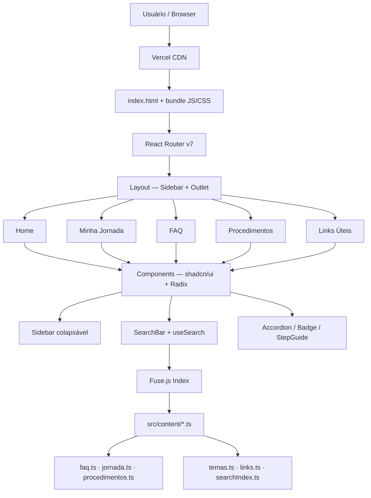
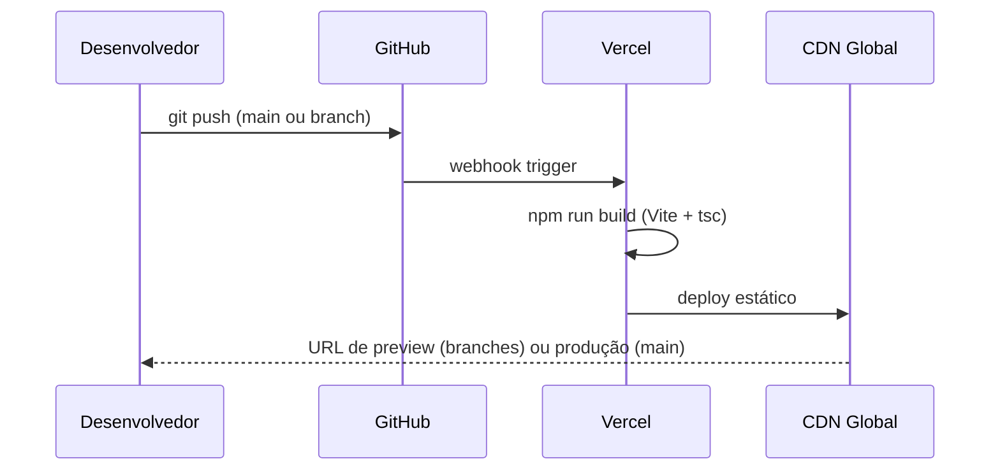

# EPR Info Hub — Stack Tecnológica

## Resumo Executivo

O EPR Info Hub é uma **Single Page Application (SPA) estática**, sem backend próprio, sem banco de dados e com custo de hospedagem zero. A stack foi escolhida para maximizar velocidade de desenvolvimento, facilidade de manutenção por não-programadores (via edição de arquivos `.ts` no GitHub) e aderência ao design system da UnB.

---

## Stack Principal

| Camada | Tecnologia | Versão |
|---|---|---|
| Linguagem | TypeScript | 6.x |
| Framework UI | React | 19.x |
| Build tool | Vite | 8.x |
| Styling | Tailwind CSS | 4.x |
| Componentes | shadcn/ui + Radix UI | latest |
| Ícones | lucide-react | latest |
| Roteamento | React Router | 7.x |
| Busca | Fuse.js | 7.x |
| Hospedagem | Vercel | — |
| CI/CD | GitHub Actions | planejado |
| Controle de versão | Git + GitHub | — |

---

## Justificativas por Camada

### TypeScript
**Por que:** tipagem estática elimina uma classe inteira de bugs em tempo de compilação. Num projeto mantido por múltiplas pessoas ao longo do tempo, a autocomplete e os erros de tipo no editor funcionam como documentação viva.
**Alternativa considerada:** JavaScript puro — descartado pela falta de segurança de tipos em projetos colaborativos.

### React + Vite
**Por que:** React é o ecossistema mais maduro para SPAs em 2026, com vasta documentação em português e curva de aprendizado conhecida pela equipe. O Vite substitui o Create React App (deprecado), oferece HMR instantâneo e build otimizado com tree-shaking nativo.
**Alternativa considerada:** Next.js — descartado porque não há necessidade de SSR/SSG para este projeto. Uma SPA pura é mais simples de hospedar estaticamente.

### Tailwind CSS v4
**Por que:** utilitário mobile-first nativo. A v4 usa configuração CSS-nativa via bloco `@theme {}` no arquivo CSS principal — elimina o `tailwind.config.ts` e torna os tokens mais próximos do CSS padrão. Permite aplicar o design system da UnB como variáveis CSS sem camadas adicionais de abstração.
**Alternativa considerada:** CSS Modules — mais verboso para este escopo; Styled Components — overhead de runtime desnecessário para um app estático.

### shadcn/ui + Radix UI
**Por que:** componentes acessíveis e sem estilo próprio (headless), copiados diretamente para o repositório — sem dependência de runtime adicional. Fornece primitivos como Tooltip, Dialog (drawer mobile) e ScrollArea com acessibilidade embutida (ARIA, foco gerenciado). O Aceternity UI registry está integrado ao `components.json` para componentes animados premium.
**Alternativa considerada:** Componentes manuais — mais trabalhoso e sem garantia de acessibilidade.

### React Router v7
**Por que:** padrão de facto para roteamento client-side em React. A v7 traz `createBrowserRouter` com layouts aninhados, lazy loading de rotas e tratamento de erros integrado.
**Alternativa considerada:** TanStack Router — mais poderoso, mas com curva de aprendizado maior para o escopo do projeto.

### Fuse.js
**Por que:** busca fuzzy client-side de alta performance, sem servidor, sem API key, sem custo. Funciona com os dados já carregados na memória da SPA. Índice construído uma vez no boot, buscas em <10ms.
**Alternativa considerada:** Algolia (plano gratuito) — dependência de serviço externo que pode ser descontinuado ou mudar de política; não justificado para um corpus pequeno e estático.

### Vercel
**Por que:** deploy automatizado a cada push no GitHub, CDN global, HTTPS gratuito, preview por branch. O plano Hobby cobre 100% das necessidades do projeto (sem backend, sem banco de dados).
**Alternativa considerada:** GitHub Pages — sem preview por branch e sem redirecionamentos para SPA out-of-the-box; Netlify — equivalente ao Vercel, mas a equipe já tem conta Vercel configurada.

---

## Design System UnB — Tokens no Tailwind v4

As cores institucionais da UnB (extraídas do *Manual de Identidade Visual*, 1ª edição) são configuradas como variáveis CSS no bloco `@theme {}` em `src/index.css`:

```css
/* src/index.css — configuração CSS-nativa do Tailwind v4 */
@import "tailwindcss";

@theme {
  --color-unb-azul:        #003366; /* Pantone 654 — Azul institucional */
  --color-unb-azul-light:  #1a4d80; /* variante hover / elementos secundários */
  --color-unb-azul-pale:   #e8eef5; /* fundos suaves, cards */
  --color-unb-verde:       #006633; /* Pantone 348 — Verde institucional */
  --color-unb-verde-light: #1a7a47; /* variante hover */
  --color-unb-verde-pale:  #e6f2ec; /* badges de sucesso, confirmações */
  --color-unb-cinza:       #f8fafc; /* fundo de página */
  --color-unb-texto:       #0f172a; /* cor primária de texto */
  --color-unb-alerta:      #c0392b; /* badges de prazo crítico */
  --color-unb-aviso:       #e67e22; /* badges de atenção */
  --font-sans: 'Inter', system-ui, sans-serif;
}
```

> **Nota importante:** O Tailwind v4 não usa mais `tailwind.config.ts` para tokens de cor. A configuração é CSS-nativa via `@theme {}`. O `postcss.config.js` usa `@tailwindcss/postcss` (não mais o plugin `tailwindcss`).

### Paleta de cores completa

| Token | Hex | Uso |
|---|---|---|
| `unb-azul` | `#003366` | Sidebar ativo, botões primários, links |
| `unb-azul-light` | `#1a4d80` | Hover de botões, bordas de destaque |
| `unb-azul-pale` | `#e8eef5` | Fundo de cards, hover de itens |
| `unb-verde` | `#006633` | Acentos, ícones de confirmação, badge "ok" |
| `unb-verde-light` | `#1a7a47` | Hover de elementos verdes |
| `unb-verde-pale` | `#e6f2ec` | Background de alertas positivos |
| `unb-alerta` | `#c0392b` | Badges de prazo crítico |
| `unb-aviso` | `#e67e22` | Badges de atenção moderada |
| `unb-cinza` | `#f8fafc` | Background geral da página |
| `unb-texto` | `#0f172a` | Texto principal |

### Tipografia

```html
<!-- index.html — Google Fonts import -->
<link href="https://fonts.googleapis.com/css2?family=Inter:wght@400;500;600;700;800&display=swap" rel="stylesheet">
```

**Inter** é o substituto visual mais próximo das fontes UnB Pro e UnB Office (ambas derivadas de Liberation Sans). Características comuns: humanista, alta legibilidade em tela, sem serifa.

---

## Arquitetura da Aplicação



---

## Estrutura de Pastas

```
EPR Info Hub/
├── docs/
│   ├── MISSION.md
│   ├── TECH_STACK.md
│   └── ROADMAP.md
├── public/
│   ├── favicon.ico
│   └── unb-logo.png          # Logo oficial da UnB
├── src/
│   ├── content/               # dados estáticos tipados
│   │   ├── types.ts           # interfaces TypeScript compartilhadas
│   │   ├── faq.ts             # perguntas frequentes
│   │   ├── jornada.ts         # jornada do estudante por fase
│   │   ├── procedimentos.ts   # guias passo a passo
│   │   ├── temas.ts           # cards de acesso rápido
│   │   ├── links.ts           # canais oficiais e links
│   │   └── searchIndex.ts     # índice Fuse.js combinado
│   ├── components/
│   │   ├── layout/
│   │   │   ├── Sidebar.tsx    # sidebar colapsável (desktop)
│   │   │   ├── MobileSidebar.tsx  # drawer lateral (mobile)
│   │   │   └── Layout.tsx     # wrapper com Outlet
│   │   └── ui/
│   │       ├── Accordion.tsx
│   │       ├── Badge.tsx
│   │       ├── SearchBar.tsx
│   │       └── StepGuide.tsx
│   ├── hooks/
│   │   └── useSearch.ts       # wrapper Fuse.js
│   ├── lib/
│   │   └── utils.ts           # utilitário cn() para clsx + tailwind-merge
│   ├── pages/
│   │   ├── Home.tsx
│   │   ├── Jornada.tsx
│   │   ├── FAQ.tsx
│   │   ├── Procedimentos.tsx
│   │   └── Links.tsx
│   ├── App.tsx                # router setup
│   ├── main.tsx
│   └── index.css              # Tailwind v4 + @theme tokens UnB
├── components.json            # shadcn/ui config + Aceternity registry
├── index.html
├── package.json
├── tsconfig.app.json
├── vite.config.ts             # alias @/ configurado
└── postcss.config.js          # @tailwindcss/postcss (Tailwind v4)
```

---

## Fluxo de CI/CD



**Regras de branch:**
- `main` → deploy automático em produção
- qualquer outra branch → URL de preview isolada

> **GitHub Actions** não está configurado ainda — o CI/CD é gerenciado diretamente pelo Vercel via webhook. GitHub Actions está planejado para a Fase 4 (validação automática de links e lint).

---

## Decisões de Acessibilidade

- HTML semântico: `<nav>`, `<main>`, `<aside>`, `<section>`, `<article>`
- Contraste mínimo AA (WCAG 2.1): Azul UnB #003366 sobre branco = ratio 12.6:1
- Foco visível em todos os elementos interativos (Radix UI gerencia foco nos componentes headless)
- `aria-label` em todos os ícones sem texto visível (lucide-react)
- `lang="pt-BR"` no `<html>`
- Drawer mobile com foco preso durante abertura (Radix Dialog)

---

## Restrições e Riscos Técnicos

| Risco | Probabilidade | Mitigação |
|---|---|---|
| Fontes UnB não disponíveis via CDN web | Alta | Inter como substituto (já configurado) |
| Conteúdo desatualizado sem mantenedor | Média | Fase 5 do roadmap define governança explícita |
| Vercel muda política do plano gratuito | Baixa | App é portável para qualquer host estático (Netlify, GitHub Pages) |
| Fuse.js performance com corpus grande | Baixa | Corpus atual < 200 itens; limite testado em 10k+ sem degradação |
